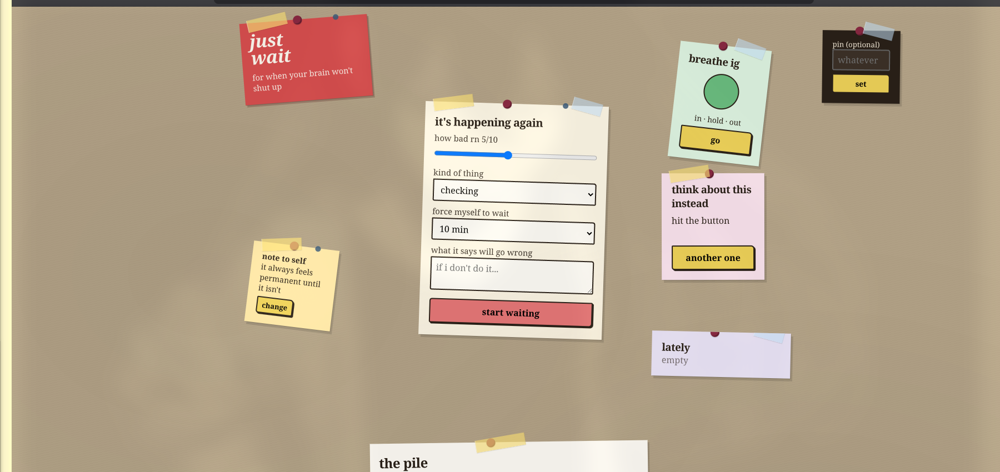
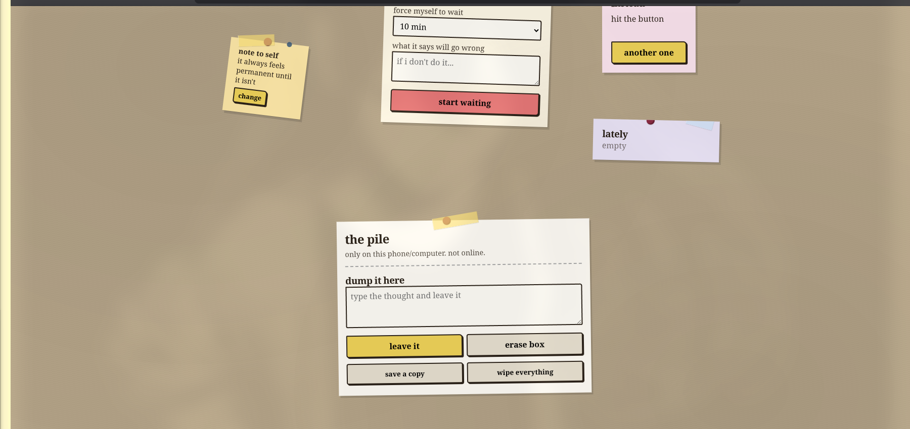

# WAIT

Your brain won't stop. The urge to check, wash, fix, or perform is loud. But you're not doing it. You're here. You're going to sit with it for a few minutes.

This is WAIT. A dead-simple web tool for when OCD has its hands on the wheel and you just need to pause.

It's not therapy. It's not a cure. It's just a timer, a reminder that you can sit with uncomfortable things, and proof on a screen that your anxiety goes down when you don't give in to the compulsion.


## Screenshots

Here's what you're working with. Everything is on one screen—sticky notes scattered around so nothing feels clinical or overwhelming.






## What It Actually Does

**The Core: The Timer**

Rate your anxiety right now (1-10). Pick what compulsion you're fighting: checking, washing, needing to fix things, or a thought that won't die. Choose how long you'll wait. Write down the fear your brain is selling you. Hit start.

The timer runs. Your anxiety slider is there. Distraction prompts available. A breathing circle if you need it. The app doesn't entertain you—it gets out of the way and lets you sit with discomfort.

When time's up: Did you hold off? Log it. Did you do the compulsion anyway? Log that too. No judgment. Either way, you get your data: time lasted, anxiety shift, pattern tracking.

**Breathe**

In-hold-out breathing guide. One click. The circle animates. Helps when your nervous system is screaming.

**Distraction Prompts**

Random thoughts to pull your brain somewhere else. Sometimes dumb ("favorite pasta shape"). Sometimes real ("what would you tell a friend who had this thought"). Hit "another one" to keep moving.

**Note to Yourself**

Write something down right now. Something you need to hear when your brain is lying. "It always passes." "I've done this before." "This feeling is temporary." Put it somewhere visible. Change it whenever you need to.

**Your Recent Attempts**

"Lately" shows you what you've fought recently. See the patterns. See that you keep trying. See that anxiety drops over time.

**The Pile**

That stuck thought? The intrusive one that won't leave? Type it into "the pile" and acknowledge it exists. Sometimes your brain lets go when you do. You can save your pile as a file or wipe it clean. Your choice.

**Privacy**

Optional PIN lock. Everything stays on your device. No servers. No one reading your thoughts. Ever.

**Offline & Everywhere**

Phone. Tablet. Desktop. Doesn't matter. No installation. Open it and go. Works when you don't have internet.


## How to Use This

**Right Now:**
Open the live app in your browser. Seriously, that's it. Nothing to install.

**Or Run It Locally:**
```bash
git clone https://github.com/STEVEALEX-source/WAIT.git
cd WAIT
# Open index.html in your browser. No build step. No npm. Nothing.
```


## The Real Talk

This app is built on one simple truth: your anxiety does go down when you don't give in to compulsions. It might take minutes. It might take longer. But it goes down. Most people with OCD never get to see that because they give in before they feel it.

WAIT is just here to hold the timer while you prove it to yourself.

You're not broken. Your brain is doing what it's been trained to do—detect threat and demand action. You're just learning to sit with the false alarm.


## Data & Privacy

- 100% local: everything stays on your device
- No servers, no accounts, no tracking
- Download your data anytime
- Wipe everything with one button
- Optional PIN if you need your pile locked


## Technical

Built with vanilla JavaScript, HTML5, CSS3. No dependencies. No build step. Just open and run. Works in all modern browsers.


## What Compulsions Look Like

The app tracks these because people often don't realize their compulsions have a pattern:

- Checking: email, locks, messages, the stove
- Washing: hands, skin, objects
- Ordering: symmetry, perfect arrangement, putting things "right"
- Thought loops: can't stop thinking about one thing
- Other: whatever else is eating your brain


## Contributing

Have ideas? Found a bug? Want to help?

Open an issue or submit a pull request. Just remember: this tool exists for people in crisis. Keep that in mind.


## Disclaimer

This is not a substitute for professional help. If you're struggling with OCD, anxiety, or intrusive thoughts:

- International OCD Foundation: www.iocdf.org
- Anxiety & Depression Association: www.adaa.org
- Talk to a therapist or doctor: seriously, do this

WAIT is a tool to use alongside actual treatment, not instead of it.


## License

MIT. Use it however you need to.


## Why This Exists

Built for anyone who knows what it feels like when OCD takes over. For people trying to learn that they can sit with uncomfortable things. For proof that anxiety isn't permanent, even when it feels like it is.

If this has helped you, star it. Share it. Tell someone else about it.

Just wait. You've got this.
